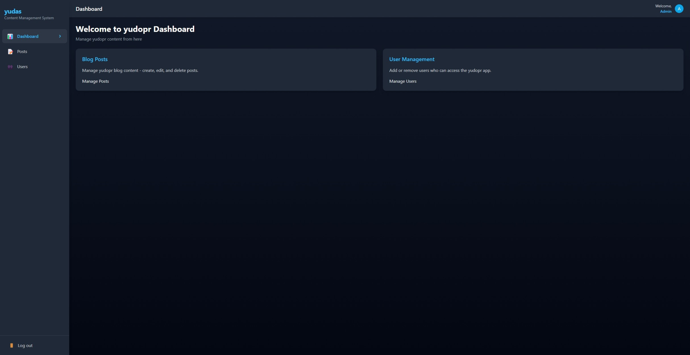

# yudas CMS

A modern, responsive content management system built with React, TypeScript and Tailwind CSS.



## Features

- 🔒 **Authentication** - Secure login system
- 📝 **Content Management** - Create, edit, and delete posts with markdown support
- 👥 **User Management** - Manage admin users
- 📊 **Dashboard** - Overview of your content
- 📱 **Fully responsive design** - Works on all devices
- 🎨 **Dark theme** - Modern, sleek interface
- 📝 **Rich Markdown support** - Write content with formatting, code blocks, and more
- 💻 **Code syntax highlighting** - With copy-to-clipboard functionality
- 🔄 **Pagination** - Efficiently browse through content
- 🏷️ **Tag support** - Organize content with tags

## Tech Stack

- **Frontend**: React, TypeScript
- **Styling**: Tailwind CSS
- **Routing**: React Router
- **State Management**: React Hooks
- **Markdown**: React Markdown with remark/rehype plugins
- **Build Tool**: Vite
- **Package Manager**: npm

## Getting Started

### Prerequisites

- Node.js (v18 or newer)
- npm or yarn

### Installation

1. Clone the repository
```bash
git clone https://github.com/yudopr11/yudas.git
cd yudas
```

2. Install dependencies
```bash
npm install
```

3. Start the development server
```bash
npm run dev
```

4. Open your browser and visit `http://localhost:3000`

## Security Considerations

1. **Environment Variables**
   - Never commit `.env` file to version control
   - Use different encryption keys for development and production
   - Keep your production encryption key secure

2. **Token Storage**
   - JWT tokens are encrypted using AES before storage in localStorage
   - Tokens are automatically decrypted when making API requests
   - Failed encryption/decryption is logged with fallback behavior
   - Error handling provides security-related feedback without exposing sensitive details

3. **Authentication**
   - Axios interceptors automatically handle authentication and refresh tokens
   - Toast notifications for authentication errors with appropriate error messages
   - Automatic redirection for expired sessions
   
## Project Structure

```
yudas/
├── public/             # Static assets
├── src/
│   ├── components/     # React components
│   │   ├── admin/      # Admin dashboard components
│   │   ├── blog/       # Markdown rendering components
│   │   └── common/     # Reusable components
│   ├── services/       # API and auth services
│   ├── App.tsx         # Main application component
│   ├── main.tsx        # Entry point
│   └── index.css       # Global styles
├── package.json        # Dependencies and scripts
├── tailwind.config.js  # Tailwind CSS configuration
├── tsconfig.json       # TypeScript configuration
└── vite.config.ts      # Vite configuration
```

## Key Components

### Admin Components

- **AdminLayout**: Main dashboard layout with responsive sidebar navigation
- **Dashboard**: Overview and statistics
- **Posts**: Post management with markdown editor
- **Users**: User management interface

### Core Service Components

- **api.ts**: API service for data fetching and manipulation
- **auth.ts**: Authentication service for login/logout functionality
- **axiosConfig.ts**: HTTP client configuration

## Building for Production

To build the app for production, run:

```bash
npm run build
```

The built files will be in the `dist` directory, ready to be deployed.

## Deployment

### Railway

This application is optimized for deployment on Railway:

1. Create an account on [Railway](https://railway.app)
2. Click "New Project" on the Railway dashboard or "New Services" inside Railway Project
3. Select "Deploy from GitHub repo"
4. Choose your cloned repository
5. Railway will automatically detect the Vite configuration and deploy your site

That's it! Railway will automatically build and deploy your application. If needed, you can add environment variables in your project settings.

## Customization

### Styling

The project uses Tailwind CSS for styling. You can customize the theme in `tailwind.config.js`.

### Environment Variables

Create a `.env` file in the root directory:

```
VITE_API_URL=your_api_url_here
```

## License

This project is licensed under the MIT License - see the LICENSE file for details.

## Acknowledgments
- Created by [yudopr](https://github.com/yudopr11)
- Built with [Vite](https://vitejs.dev/), [React](https://reactjs.org/), [TypeScript](https://www.typescriptlang.org/), and [Tailwind CSS](https://tailwindcss.com/)
- Deploy with [Railway](https://railway.app)